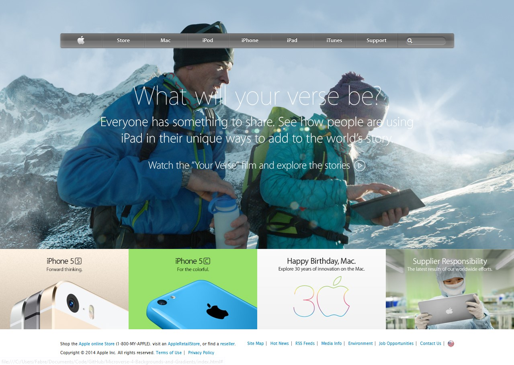

# Background and Gradients

> This is the fourth project of the Microverse Courses.

Replicating a landing page from Apple

## Built With

- HTML,
- CSS,

## GitHub Repo

- https://github.com/Eder-PG/Microverse-4-Backgrounds-and-Gradients

## Live Version

- https://eder-pg.github.io/Microverse-4-Backgrounds-and-Gradients/

## Author

👤 **Eder Palmeros Gracia**

- Github: [@Eder-PG](https://github.com/Eder-PG)
- Twitter: [@eder_palmeros](https://twitter.com/eder_palmeros)
- Linkedin: [Eder Palmeros](https://www.linkedin.com/in/ederpg/)

Give a ⭐️ if you like this project!

## Acknowledgments

- Microverse
- My Family
- Everyone else

## 📝 License

Distributed under the MIT License. See `LICENSE` for more information.
